# Code Architecture & Data Flow Documentation

## Overview
This document provides a detailed technical overview of the `aer_parser` codebase, focusing on the `src/` directory structure, module responsibilities, and data flow patterns.

## Directory Structure
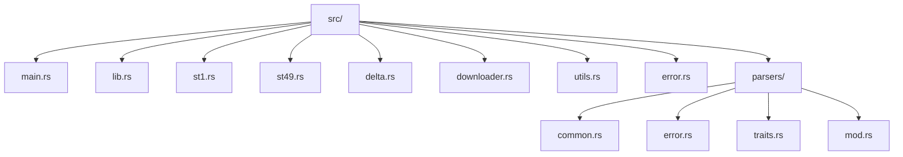

## Module Deep Dive

### 1. main.rs - CLI Entry Point
**Responsibility**: Command-line interface orchestration and workflow coordination

**Data Flow**:
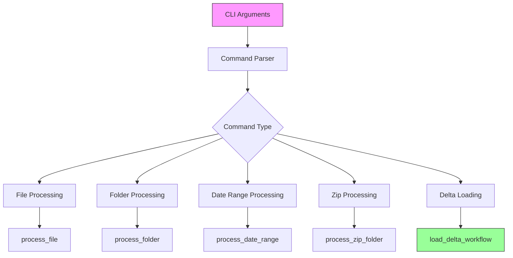

**Key Functions**:
- `main()`: Entry point with async runtime
- Command routing based on CLI subcommands
- Delta Lake loading orchestration

### 2. lib.rs - Library Interface
**Responsibility**: Public API exports and shared types

**Exports**:
- `ReportType` enum (St1, St49)
- `AppError` type
- Processing functions: `process_file`, `process_folder`, `process_date_range`, `process_zip_folder`

### 3. st1.rs - ST1 Report Parser
**Responsibility**: Parsing ST1 (WELLS) reports

**Data Structure**:
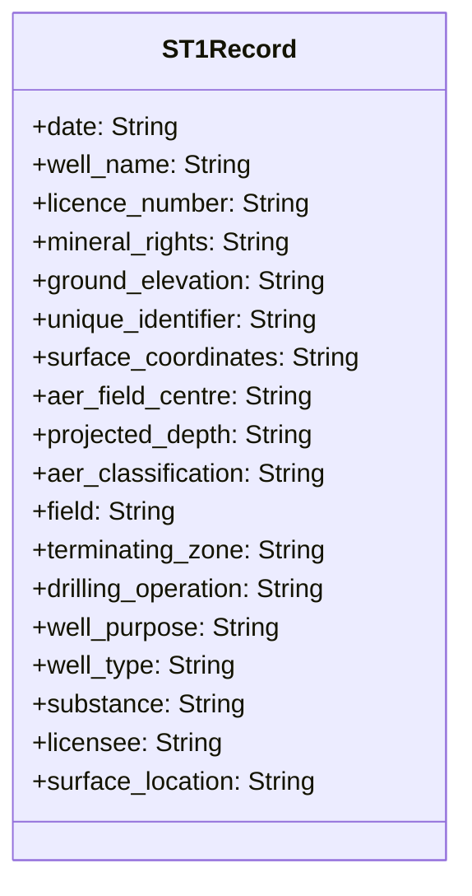

**Parsing Flow**:
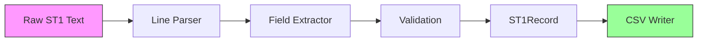

### 4. st49.rs - ST49 Report Parser
**Responsibility**: Parsing ST49 (SPUD) reports

**Data Structure**:
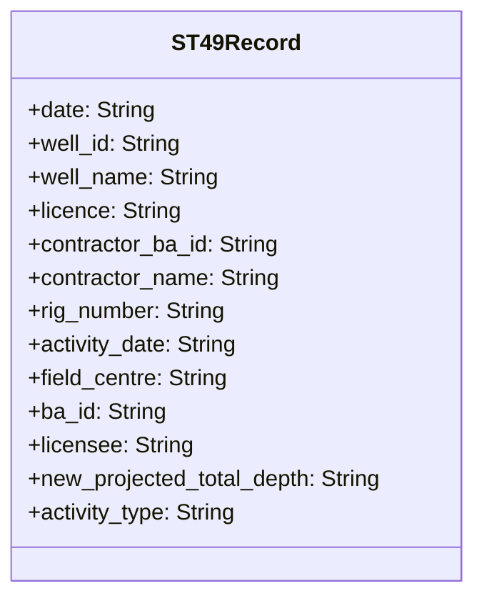

**Parsing Flow**:
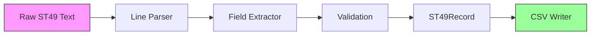

### 5. delta.rs - Delta Lake Integration
**Responsibility**: Delta Lake table creation, data loading, and maintenance

**Architecture**:
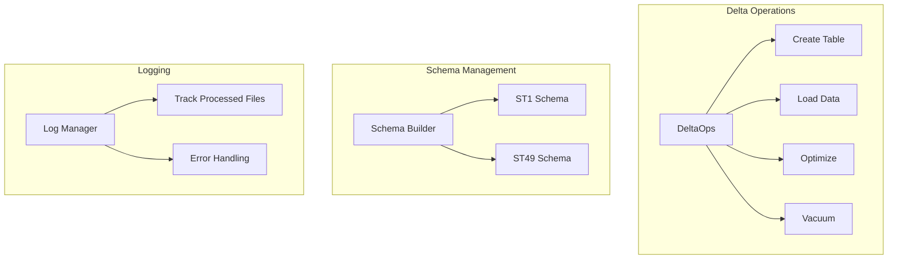

**Key Components**:
- `create_or_open_delta_table()`: Table initialization
- `load_csv_to_delta()`: Data ingestion
- `read_load_log()`: Process tracking
- `log_loaded_csv()`: Audit trail

### 6. downloader.rs - File Downloading
**Responsibility**: Asynchronous file retrieval from AER

**Download Flow**:
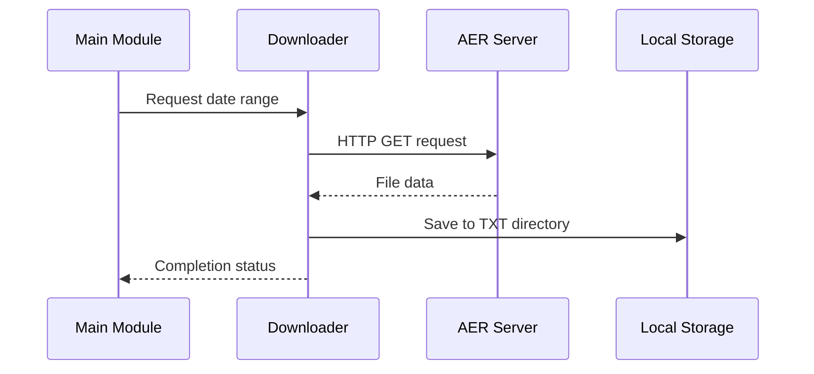

### 7. utils.rs - Utility Functions
**Responsibility**: Shared utilities and helper functions

**Utilities**:
- Date parsing and formatting
- File path handling
- String manipulation
- Error context creation

### 8. error.rs - Error Handling
**Responsibility**: Centralized error types and handling

**Error Hierarchy**:
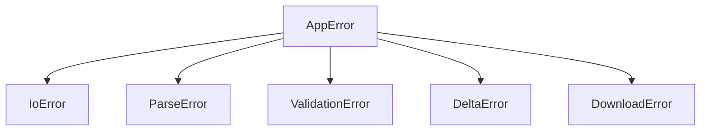

### 9. parsers/ - Parser Utilities
**Responsibility**: Shared parsing infrastructure

#### parsers/common.rs
- File reading utilities
- CSV writing with pipe delimiter
- Progress reporting

#### parsers/error.rs
- Parser-specific error types
- Context creation for parsing failures

#### parsers/traits.rs
- Trait definitions for parser interfaces
- Shared behavior contracts

#### parsers/mod.rs
- Module exports and organization

## Data Flow Patterns

### 1. File Processing Pipeline
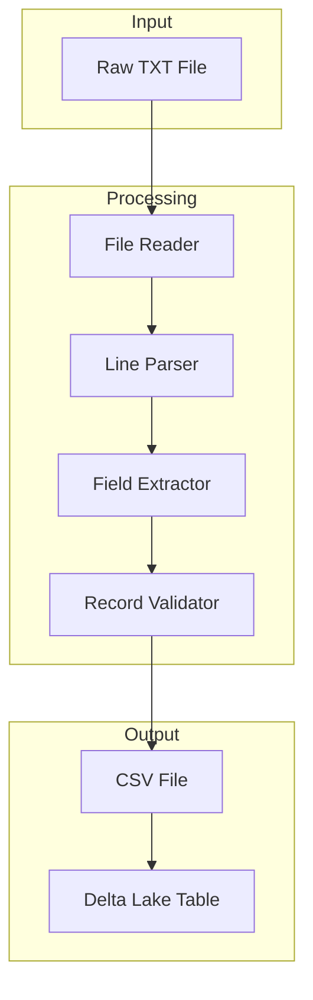

### 2. Delta Lake Loading Pipeline
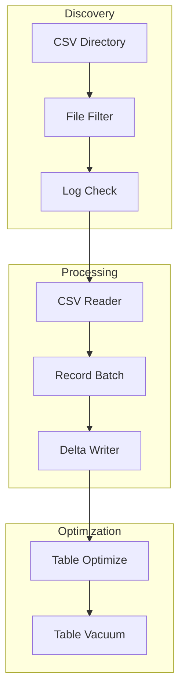

### 3. Error Handling Flow
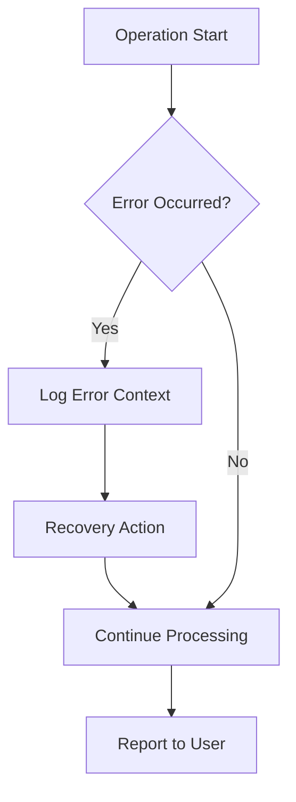

## Memory Management

### Streaming Operations
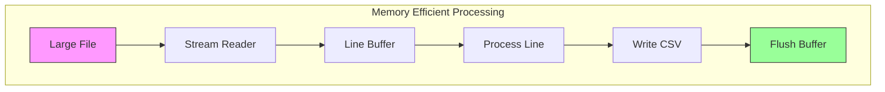

### Delta Lake Memory Usage
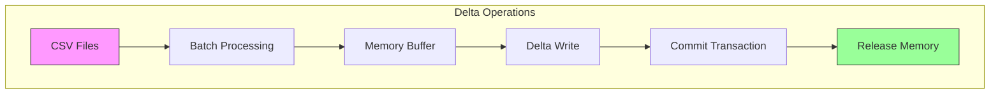

## Configuration Patterns

### CLI Argument Processing
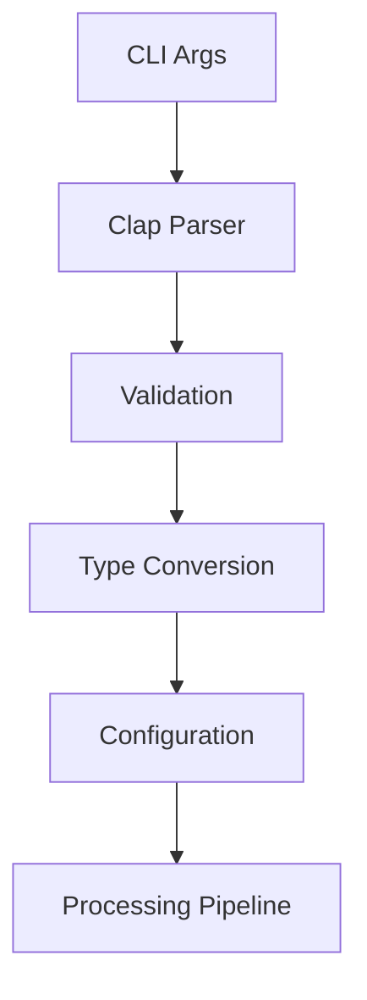

### Environment Configuration
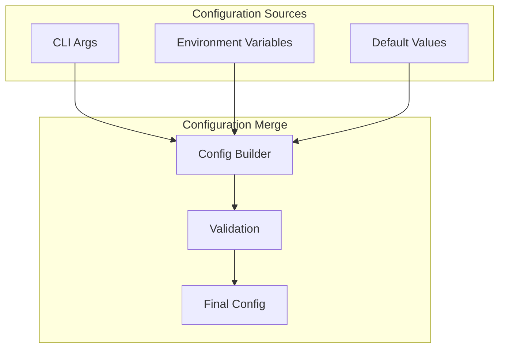

## Testing Architecture

### Unit Test Structure
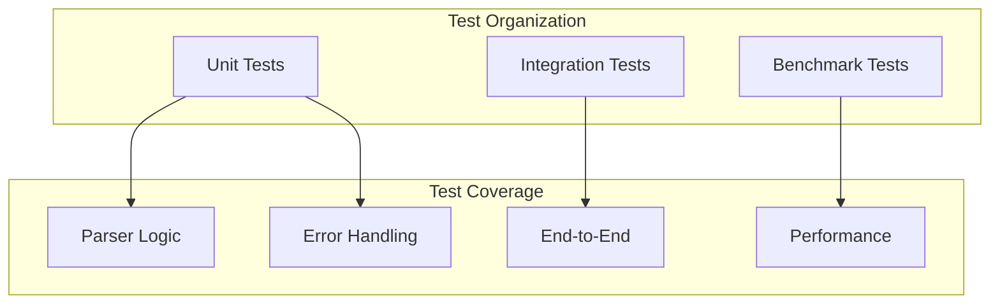

### Test Data Flow
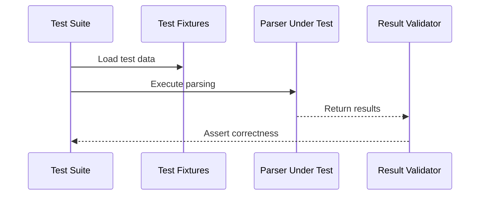

## Performance Considerations

### Memory Optimization
- **Streaming**: Large files processed line-by-line
- **Buffering**: Controlled memory usage with configurable buffer sizes
- **Lazy Loading**: Data loaded only when needed

### CPU Optimization
- **Parallel Processing**: Async operations for I/O bound tasks
- **Efficient Algorithms**: Optimized parsing for field extraction
- **Minimal Allocations**: Reuse of string buffers where possible

### Storage Optimization
- **Delta Lake**: Automatic file compaction and cleanup
- **Compression**: Zstd compression for parquet files
- **Partitioning**: Date-based partitioning for efficient queries

## Extension Points

### Adding New Report Types
1. Create new parser module (e.g., `st2.rs`)
2. Implement parsing logic following ST1/ST49 patterns
3. Add to CLI commands
4. Update Delta Lake schema

### Custom Output Formats
1. Implement new writer in `parsers/common.rs`
2. Add CLI option for format selection
3. Update configuration handling

### Enhanced Error Recovery
1. Extend error types in `error.rs`
2. Add recovery strategies in parsers
3. Update logging and reporting
