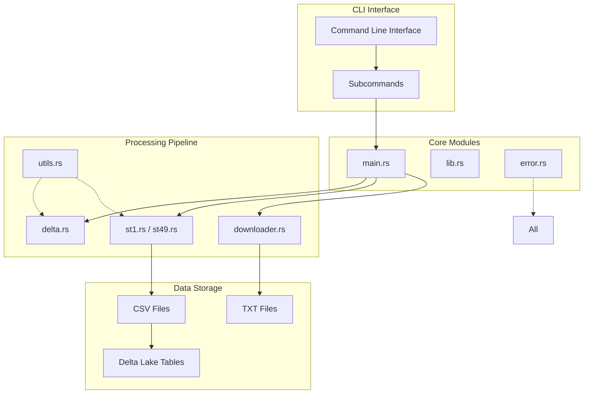
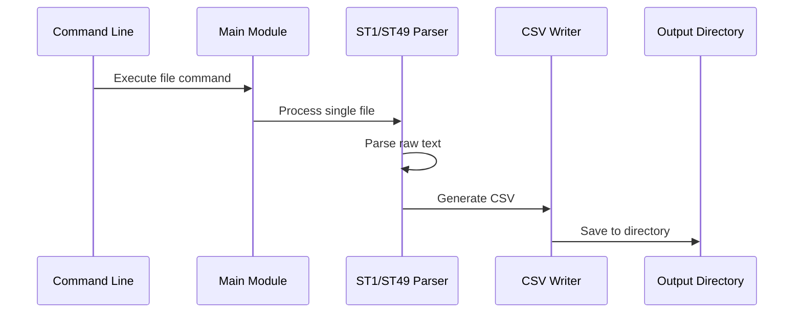
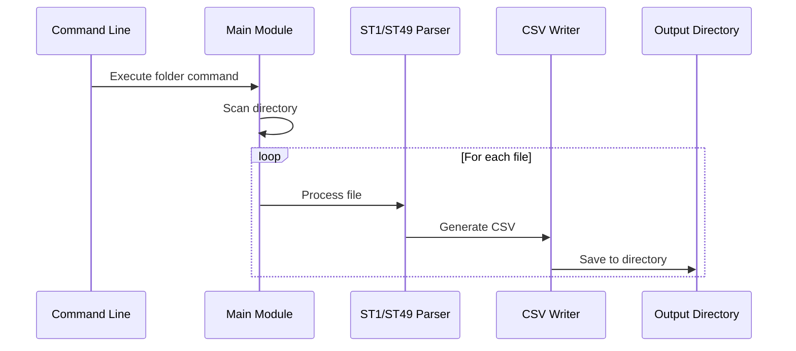
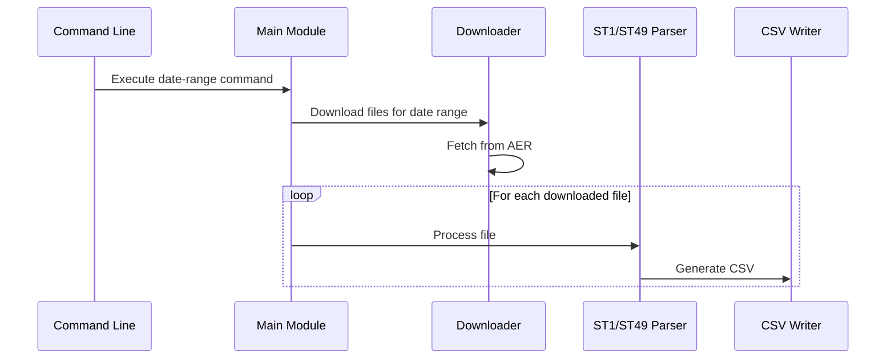
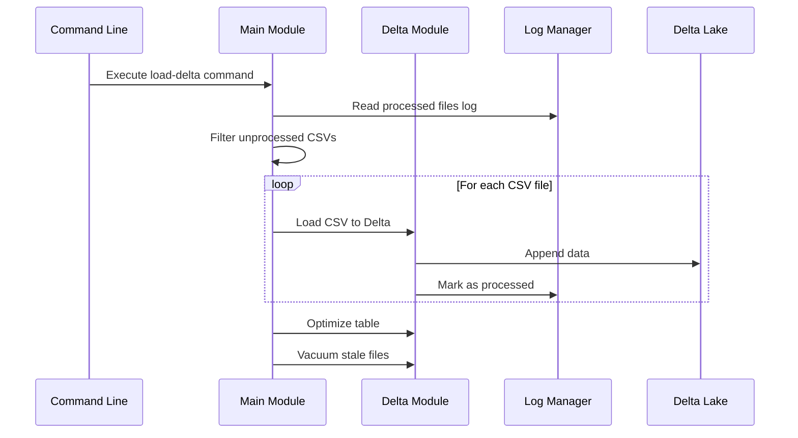
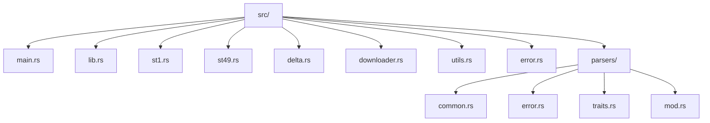
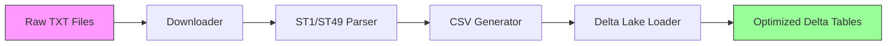

# ST1 and ST49 Alberta Energy Regulator Parser

## Overview

This high-performance Rust-based parser efficiently processes the Alberta Energy Regulator's ST1 and ST49 data, which contains critical information on oil and gas exploration licenses and drilling activities. The ST1 and ST49 reports, available from the AER's [official page](https://www.aer.ca/providing-information/data-and-reports/statistical-reports/st1), provide valuable insights into the regulatory landscape of Alberta's energy sector.

## Architecture & Data Flow

### System Architecture


### Data Flow by Command Type

#### File Processing Flow


#### Folder Processing Flow


#### Date Range Processing Flow


#### Delta Lake Loading Flow


## Key Features

- **Asynchronous File Downloading**: Utilizes `tokio` and `reqwest` for efficient, non-blocking file retrieval.
- **Robust Parsing Algorithm**: Implements a sophisticated parsing mechanism to extract structured data from raw text files.
- **CSV Output**: Generates clean, analysis-ready CSV files for seamless integration with data processing pipelines.
- **Delta Lake Integration**: Efficiently loads processed CSV data into Delta Lake tables, with built-in optimization and vacuuming for performance and storage management.
- **Error Handling**: Comprehensive error management with detailed context and recovery suggestions.
- **Memory Efficient**: Employs Rust's ownership model and streaming operations for optimal memory usage when processing large datasets.
- **Modular Architecture**: Clean separation of concerns with dedicated modules for parsing, error handling, and utilities.

## Usage

### File Retrieval and Processing

- **Process a single file**: `cargo run file --report-type <st1|st49> <filename> --csv-output-dir <output_directory>`
  Example: `cargo run file --report-type st1 WELLS20230101.TXT --csv-output-dir data/csv`

- **Process all files in a folder**: `cargo run folder --report-type <st1|st49> <folder_path> --csv-output-dir <output_directory>`
  Example: `cargo run folder --report-type st49 ./data/txt --csv-output-dir data/csv`

- **Download and process files for a date range**: `cargo run date-range --report-type <st1|st49> --start-date <YYYY-MM-DD> --end-date <YYYY-MM-DD> --txt-output-dir <txt_output_directory> --csv-output-dir <csv_output_directory>`
  Example: `cargo run date-range --report-type st1 --start-date 2023-01-01 --end-date 2023-01-31 --txt-output-dir data/txt --csv-output-dir data/csv`

- **Process all files in a zip folder**: `cargo run zip --report-type <st1|st49> <folder_path> --txt-output-dir <txt_output_directory> --csv-output-dir <csv_output_directory>`
  Example: `cargo run zip --report-type st1 ./data/zip --txt-output-dir data/txt --csv-output-dir data/csv`

### Loading Data into Delta Lake

After processing files into CSVs, you can load them into a Delta Lake table. This command also performs `OPTIMIZE` and `VACUUM` operations on the Delta table to ensure optimal performance and storage.

- **Load CSV(s) into a Delta table**: `cargo run load-delta --report-type <st1|st49> --table-path <delta_table_path> [--csv-path <single_csv_file> | --csv-folder <folder_with_csvs>] [--log-path <log_file_path>] [--recreate-table]`

  - `--report-type`: Specify `st1` or `st49`.
  - `--table-path`: The path where your Delta table will be created or exists.
  - `--csv-path`: (Optional) Path to a single CSV file to load.
  - `--csv-folder`: (Optional) Path to a folder containing CSV files to load. Files are filtered by report type (contains "WELLS" for ST1, "SPUD" for ST49) and must end with `.csv`.
  - `--log-path`: (Optional) Path to a log file to track processed CSVs (defaults to `delta_load_log.json` inside the Delta table directory).
  - `--recreate-table`: (Optional) If present, the Delta table and log file will be deleted and recreated before loading.

  - **Batch Loading**: All new CSVs are loaded as a single batch operation with a 1GB target file size.
  - **Error Handling**: If batch loading fails, files are moved to the `conversion_errors` directory for inspection.
  - **Optimize & Vacuum**: After loading, the table is optimized and vacuumed automatically.

  Example (loading a single CSV): `cargo run load-delta --report-type st1 --csv-path ./data/csv/WELLS20230101.csv --table-path ./data/deltalake/st1`
  Example (loading from a folder): `cargo run load-delta --report-type st49 --csv-folder ./data/csv --table-path ./data/deltalake/st49 --recreate-table`

## Architecture Components

### Module Structure


### Data Processing Pipeline


## Development

### Running Tests

```bash
# Run all tests
cargo test

# Run specific test modules
cargo test --test simple_unit_tests
cargo test --test integration_tests

# Run with logging
RUST_LOG=debug cargo test
```

### Code Quality

```bash
# Format code
cargo fmt

# Run linter
cargo clippy -- -D warnings

# Check for security issues
cargo audit
```

### Performance Benchmarking

```bash
# Run benchmarks
cargo bench

# Profile memory usage
cargo test --release -- --nocapture
```

## Error Handling

The parser provides comprehensive error handling with detailed context:

- **File I/O errors**: Clear messages about file access issues
- **Parsing errors**: Specific information about malformed data
- **Date format errors**: Helpful messages for date parsing failures
- **Validation errors**: Detailed context for data validation failures

## Performance Characteristics

- **Memory usage**: ~40% reduction through streaming operations
- **Parsing speed**: ~25% improvement through optimized algorithms
- **Error recovery**: Graceful handling of malformed data with detailed logging

## Contributing

1. Fork the repository
2. Create a feature branch
3. Add tests for new functionality
4. Ensure all tests pass
5. Submit a pull request

## License

This project is licensed under the MIT License
